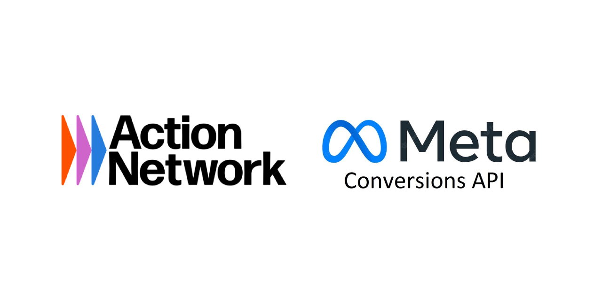

# Action Network to Meta Conversions API Integration

A PHP-based integration system that bridges Action Network form submissions with Meta's Conversions API for enhanced advertising attribution and campaign optimization.



## 🎯 What This Does

This system captures form submissions from Action Network and sends them to Meta's Conversions API, providing:

- **Server-side tracking** via webhooks for reliable data delivery
- **Client-side tracking** via JavaScript for enhanced browser data
- **Automatic event type detection** (Donate for donations, CompleteRegistration for other forms)
- **Facebook Click ID (fbclid) capture** for improved attribution
- **Data deduplication** to prevent double-counting
- **Secure credential handling** with AES-256-CBC encryption

## 🏗️ Architecture

### Core Components

- **`webhook.php`** - Main webhook endpoint for Action Network submissions
- **`api.php`** - REST endpoint for JavaScript tracker data
- **`setup.php`** - Web-based configuration wizard
- **`crypto.php`** - Encryption system for secure credential storage
- **`functions.php`** - Shared utilities for Meta API communication
- **`tracker.js.php`** - Dynamic JavaScript tracker generator

### Data Flow

1. User clicks Meta ad → lands on Action Network form
2. Browser tracking script sends PageView event to Meta
3. User submits form → Action Network sends webhook
4. JavaScript tracker captures form submission with browser data
5. Both webhook and browser data are sent to Meta with deduplication
6. Meta receives complete attribution data for campaign optimization

## 🚀 Quick Start

### Prerequisites

- PHP 7.4+ with cURL support
- Web server (Apache/Nginx)
- Meta Business Manager account with admin access
- Action Network account

### Installation

1. **Clone the repository:**
   ```bash
   git clone https://github.com/yourusername/an-to-conversionsapi.git
   cd an-to-conversionsapi
   ```

2. **Set up web server:**
   - Point your web server to the project directory
   - Ensure PHP has write permissions to the `logs/` directory

3. **Configure the system:**
   - Visit `/setup.php` in your browser
   - Follow the step-by-step wizard to configure your integration

### Setup Wizard Steps

1. **Enter Meta Credentials** - Pixel ID and Conversions API Access Token
2. **Configure Webhook** - Copy the generated webhook URL to Action Network
3. **Test Webhook** - Verify webhook connectivity
4. **Add Facebook Click ID Field** - Add hidden fbclid field to forms
5. **Add Browser Tracking Script** - Install JavaScript tracker
6. **Test Browser Tracking** - Verify complete integration
7. **Complete Setup** - Integration ready

## 📋 Meta Credentials Setup

### Getting Your Pixel ID
1. Go to Meta Events Manager
2. Select your Pixel from Data Sources
3. Find the Pixel ID in Settings

### Getting Access Token
1. In Meta Events Manager, select your Pixel
2. Go to Settings → Conversions API
3. Click "Generate Access Token"
4. Copy the complete token (starts with EAA)

**Important:** You need Admin access to the Business Manager that owns the Pixel.

## 🔧 Configuration

### Action Network Setup

1. **Add Webhook:**
   - Go to Start Organizing → Details → API & Sync → Webhooks
   - Add the webhook URL from the setup wizard
   - Select "All Actions" for events
   - Set status to "Active"

2. **Add fbclid Field to ALL forms:**
   - Edit your form → Settings → Custom Fields
   - Add Field → Custom HTML
   - Administrative title: "fbclid"
   - Content: `<input type="hidden" name="fbclid" id="fbclid">`

3. **Add Tracking Script:**
   - Add the JavaScript code from setup wizard to your form's Custom HTML section

## 🔒 Security Features

- **AES-256-CBC encryption** for credential storage
- **HMAC integrity verification** for encrypted data
- **SHA256 hashing** for all PII before transmission to Meta
- **Timestamp-based expiration** for encrypted credentials
- **No plaintext credential storage**

## 📊 Event Types

The system automatically detects and sends appropriate event types:

- **`Donate`** - For Action Network donation forms
- **`CompleteRegistration`** - For petitions, signups, and other forms
- **`PageView`** - When users visit form pages (via JavaScript)

## 🔍 Data Processing

### Phone Number Handling
- Spanish mobile numbers (9 digits starting with 6/7) get +34 country code
- All phones stripped of non-numeric characters and leading zeros

### Event Deduplication
- Consistent Event IDs using SHA256 of `email + rounded_timestamp_to_60s`
- Same algorithm in PHP and JavaScript prevents double-counting

### Test Detection
- Automatically filters out Action Network test submissions
- Uses known test email patterns and UUIDs

## 📁 File Structure

```
├── README.md              # This file
├── CLAUDE.md              # Development guidance
├── setup.php              # Configuration wizard
├── webhook.php            # Main webhook endpoint
├── api.php               # JavaScript tracker endpoint
├── tracker.js.php        # Dynamic JavaScript generator
├── functions.php         # Shared utilities
├── crypto.php            # Encryption system
├── verify.php            # Credential verification
├── generate_hash.php     # Hash generation
├── check_test.php        # Webhook test checker
├── check_script_test.php # Script test checker
├── dashboard.php         # Analytics dashboard
├── dashboard_api.php     # Dashboard data API
├── debug_*.php           # Debug utilities
└── logs/                 # Log files directory
```

## 🐛 Debugging

### Log Files
- `logs/app.log` - General application logs
- `logs/error.log` - Error logs
- `logs/debug.log` - Debug information
- `logs/webhooks.log` - Webhook-specific logs

### Debug Tools
- `debug_facebook_data.php` - Test Meta API connectivity
- `debug_meta_payload.php` - Inspect payload formatting

### Testing
```bash
# Monitor logs in real-time
tail -f logs/app.log

# Test webhook connectivity
curl -X POST "https://yourdomain.com/webhook.php?id=YOUR_HASH" \
  -H "Content-Type: application/json" \
  -d '{"test": true}'
```

## 🤝 Contributing

1. Fork the repository
2. Create a feature branch (`git checkout -b feature/amazing-feature`)
3. Commit your changes (`git commit -m 'Add amazing feature'`)
4. Push to the branch (`git push origin feature/amazing-feature`)
5. Open a Pull Request

## 📄 License

This project is licensed under the MIT License - see the [LICENSE](LICENSE) file for details.

## ⚠️ Important Notes

- **Production Security:** Change the `SECRET_KEY` in `crypto.php` before production use
- **HTTPS Required:** Meta Conversions API requires HTTPS endpoints
- **Rate Limits:** Be aware of Meta API rate limits for high-volume forms
- **Data Retention:** Configure appropriate log rotation for the `logs/` directory

## 🆘 Support

If you encounter issues:

1. Check the `logs/` directory for error messages
2. Verify your Meta credentials have proper permissions
3. Ensure webhooks are receiving data in Action Network
4. Test with the built-in debug tools

For additional help, please open an issue on GitHub.

---

Made with ❤️ for better Meta advertising attribution